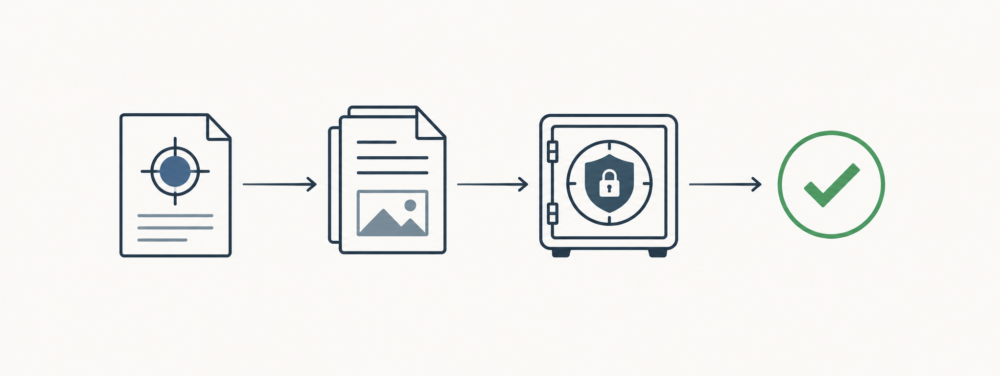

# OpLog



OpLog is a small, local-first evidence ledger for **authorised** security
engagements. It helps an operator keep one portable workspace containing the
scope, timestamped activity, collected artifacts, deployment inventory and
cleanup attestations.

It does not execute tools, store credentials, manage payloads, control C2, or
perform scanning. OpLog records the work and the evidence after it has been
performed under an approved Rules of Engagement.

Created by [Soheil Hashemi](https://github.com/soheilsec).

For a complete engagement workflow, read the [Operator Guide](docs/OPERATOR_GUIDE.md).

## Features in 0.1

- Creates a clean engagement workspace with SQLite data and evidence folders.
- Adds append-only events linked to the hash of the active `scope.yml`.
- Copies evidence into the workspace and records its SHA-256.
- Records authorised deployment metadata and cleanup status.
- Produces Markdown timeline, evidence-register and cleanup reports.
- Uses a small dependency set: Python's standard library plus `cryptography`.
- Keeps operator-only secrets in an AES-256-GCM encrypted vault.

## Install

Python 3.10 or newer is required.

```bash
python -m pip install -e .
```

For a one-off run without installation:

```bash
PYTHONPATH=src python -m oplog --help
```

## Quick start

```bash
oplog init acme-q3 --name "Acme Q3 authorised assessment"

oplog event add --workspace acme-q3 --operator soheil \
  --phase discovery --asset host:example.internal --technique T1595 \
  --summary "Approved observation recorded."

oplog artifact add ./notes/approved-output.txt --workspace acme-q3 --event 1

oplog manifest record-deployment --workspace acme-q3 \
  --campaign RT-2026-014 --label approved-tooling --asset host:example.internal \
  --build-sha256 <sha256> --expires 2026-10-01

oplog manifest cleanup --workspace acme-q3 --deployment 1 \
  --operator soheil --status removed

oplog report timeline --workspace acme-q3 --out reports/timeline.md
oplog report evidence --workspace acme-q3 --out reports/evidence.md
oplog report cleanup --workspace acme-q3 --out reports/cleanup.md
oplog status --workspace acme-q3
```

The `--out` path is relative to the workspace unless you provide an absolute
path. Generated reports appear under `acme-q3/reports/` in the example above.

Once you are inside a workspace, `--workspace` is optional:

```bash
cd acme-q3
oplog status
```

## Encrypted operator vault

By default, `oplog init` asks for a vault passphrase and creates
`vault.oplog`. The public SQLite ledger and generated reports never contain
secret values. A passphrase cannot be recovered, so retain it safely.

```bash
cd acme-q3
oplog vault add --type password --label "temporary lab credential" --event 3
oplog vault list
oplog vault show 1 --reveal
```

Secret values are entered through a hidden prompt; never include them in the
command line. `vault list` shows metadata only. `vault show` requires the
explicit `--reveal` flag. `oplog init --no-vault` is available only for a
public-ledger-only workspace.

`vault.oplog` is encrypted with AES-256-GCM. Its encryption key is derived
from the passphrase using scrypt with a unique random salt. The vault is a
single-operator feature in this release; it is not a multi-user secret manager.

## Workspace layout

```text
acme-q3/
├── evidence/artifacts/       # copied evidence, named with a hash prefix
├── reports/                  # generated Markdown reports
├── oplog.db                  # SQLite engagement ledger
└── scope.yml                 # approved scope; hash is linked to each event
```

## Design boundaries

- Events are append-only: corrections should be recorded as a new event.
- Artifact hashes prove which exact file supported a record.
- The scope file is not parsed or enforced in 0.1; its hash establishes which
  version was in force when the event was entered.
- Deployment tracking is deconfliction and cleanup metadata only.

## Development

```bash
python -m unittest discover -s tests -v
```

## Sensible next features

1. Parse `scope.yml` and flag scope exceptions.
2. Add a read-only Nmap XML importer with collection-run provenance.
3. Add report signing or a tamper-evident chain verification command.
4. Add offline importers for approved Certipy or BloodHound exports.

## HTB Pirate exercise

`examples/pirate_demo.py` creates a sanitised lab workspace based on the public
Pirate storyline. It is designed to show both what the MVP records well and
what it still lacks. Read [examples/PIRATE_DEMO.md](examples/PIRATE_DEMO.md)
before using it.
